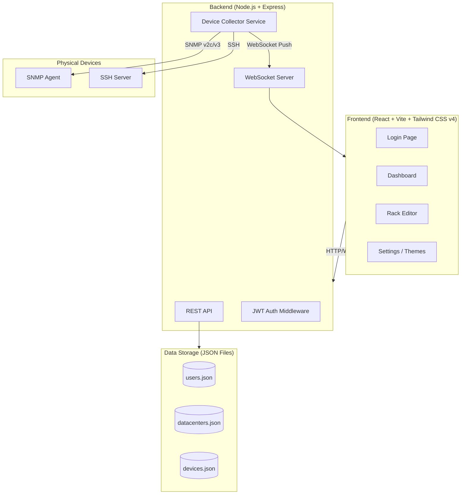

# Server Rack Layout Management Platform

A full-stack server rack visualization and management system with real-time device monitoring, drag-and-drop editing, SNMP/SSH connectivity, and Docker deployment.

**Project Location:** `c:\Users\Noel\.gemini\server-rack-layout\`

---

## Architecture Overview



---

## Technology Stack

| Layer | Technology | Version |
|-------|-----------|---------|
| Frontend Framework | React | 18.x |
| Build Tool | Vite | 6.x |
| CSS Framework | Tailwind CSS | 4.x |
| Drag & Drop | `@dnd-kit/core` + `@dnd-kit/sortable` | latest |
| State Management | React Context + useReducer | built-in |
| Backend | Node.js + Express | 20.x / 4.x |
| WebSocket | `ws` | 8.x |
| Authentication | `jsonwebtoken` + `bcryptjs` | latest |
| SNMP | `net-snmp` | latest |
| SSH | `ssh2` | latest |
| Data Storage | JSON files (fs/promises) | built-in |
| Container | Docker + Docker Compose | latest |

---

## User Review Required

> [!IMPORTANT]
> **Tailwind CSS**: You requested Tailwind CSS specifically. I'll use **Tailwind CSS v4** with the new `@tailwindcss/vite` plugin (simplified setup, no config file needed). Please confirm this is acceptable.

> [!IMPORTANT]
> **4 Theme Styles**: I plan to implement these 4 themes:
> 1. **Dark Mode** (default) — Dark background with blue/cyan accents, ideal for data center ops
> 2. **Light Mode** — Clean white/gray with professional blue tones
> 3. **Cyberpunk** — Neon green/purple on deep black, futuristic feel
> 4. **Solarized** — Warm, eye-friendly Solarized color palette
>
> Please confirm or suggest alternatives.

> [!WARNING]
> **SNMP/SSH Connectivity**: These features require actual network access to physical devices. In the initial build, I will implement the full collector architecture with mock data fallback. Real device connections will work when configured with valid credentials and the Docker container has network access to target devices.

---

## Open Questions

> [!IMPORTANT]
> 1. **Default admin credentials**: I'll create a default admin account `admin / admin123` on first run. Should I use different defaults?
> 2. **Rack sizes**: You mentioned 42U. Should I also support other sizes (e.g., 20U, 24U, 48U) as configurable options?
> 3. **Multi-user**: Is this a single-user or multi-user system? I'll implement simple single-admin for now with the option to add more local accounts.

---

## Proposed Changes

### Project Structure

```
server-rack-layout/
├── docker-compose.yml
├── .env.example
├── frontend/
│   ├── Dockerfile
│   ├── package.json
│   ├── vite.config.js
│   ├── index.html
│   ├── public/
│   └── src/
│       ├── main.jsx
│       ├── App.jsx
│       ├── index.css                   # Tailwind + theme variables
│       ├── contexts/
│       │   ├── AuthContext.jsx          # Auth state
│       │   └── ThemeContext.jsx         # Theme state
│       ├── components/
│       │   ├── Layout/
│       │   │   ├── AppLayout.jsx        # Main app shell
│       │   │   ├── Sidebar.jsx          # Navigation sidebar
│       │   │   └── Header.jsx           # Top bar with settings
│       │   ├── Auth/
│       │   │   └── LoginPage.jsx        # Login form
│       │   ├── Rack/
│       │   │   ├── RackEditor.jsx       # Main rack editing view
│       │   │   ├── RackView.jsx         # 42U rack visualization
│       │   │   ├── RackSlot.jsx         # Individual U slot (droppable)
│       │   │   ├── DeviceItem.jsx       # Device in rack (draggable)
│       │   │   └── DeviceModal.jsx      # Edit device modal
│       │   ├── DevicePanel/
│       │   │   ├── DeviceList.jsx       # Left panel device library
│       │   │   └── DeviceDragPreview.jsx # Custom drag preview
│       │   ├── Dashboard/
│       │   │   ├── DashboardPage.jsx    # Main dashboard
│       │   │   ├── StatusCard.jsx       # Device status summary
│       │   │   ├── RackOverview.jsx     # Mini rack previews
│       │   │   └── AlertsList.jsx       # Recent alerts
│       │   ├── DataCenter/
│       │   │   ├── DataCenterList.jsx   # Datacenter/rack management
│       │   │   └── RackForm.jsx         # Add/edit rack form
│       │   └── Settings/
│       │       ├── SettingsModal.jsx    # Settings overlay
│       │       ├── PasswordChange.jsx   # Change password form
│       │       └── ThemePicker.jsx      # Theme selection
│       ├── hooks/
│       │   ├── useApi.js               # API fetch helper
│       │   └── useWebSocket.js         # WebSocket hook
│       └── utils/
│           ├── deviceTypes.js          # Device type definitions & icons
│           └── constants.js            # App constants
├── backend/
│   ├── Dockerfile
│   ├── package.json
│   └── src/
│       ├── index.js                    # Express + WS server entry
│       ├── middleware/
│       │   └── auth.js                 # JWT auth middleware
│       ├── routes/
│       │   ├── auth.js                 # Login / password change
│       │   ├── datacenters.js          # Datacenter CRUD
│       │   ├── racks.js                # Rack CRUD
│       │   ├── devices.js              # Device CRUD
│       │   └── monitor.js              # Device monitoring data
│       ├── services/
│       │   ├── storage.js              # JSON file storage service
│       │   ├── snmpCollector.js        # SNMP data collection
│       │   ├── sshCollector.js         # SSH data collection
│       │   └── deviceMonitor.js        # Orchestrates polling
│       └── data/                       # JSON data directory (volume mounted)
│           ├── users.json
│           ├── datacenters.json
│           └── devices.json
└── README.md
```

---

### Frontend Components

#### [NEW] Login Page (`LoginPage.jsx`)
- Premium glassmorphism login card centered on animated gradient background
- Username/password form with JWT token storage
- Auto-redirect to Dashboard on successful login
- Error animation on failed login

#### [NEW] App Layout (`AppLayout.jsx`, `Sidebar.jsx`, `Header.jsx`)
- Left sidebar navigation: Dashboard, Data Centers, Rack Editor
- Top header with datacenter/rack selector, user avatar, Settings gear icon
- Settings button opens modal for password change and theme picker
- Responsive layout with collapsible sidebar

#### [NEW] Rack Editor (`RackEditor.jsx`)
- **Three-column layout:**
  - **Left (250px):** Device library panel — draggable device templates grouped by type (Server, Network, Power, etc.)
  - **Center (flexible):** 42U rack visualization with numbered U slots
  - **Right (300px):** Selected device detail/properties panel
- **DnD-Kit integration:**
  - `DndContext` wrapping the editor
  - Device library items are `Draggable` sources
  - Each U slot in the rack is a `Droppable` target
  - Custom `DragOverlay` showing device preview while dragging
- Click on empty slot → opens "Add Device" modal
- Click on placed device → opens "Edit Device" modal

#### [NEW] Rack View (`RackView.jsx`)
- Realistic 42U rack rendering with:
  - Metal frame borders (gradient effect simulating depth)
  - U number labels on left side (42 at top, 1 at bottom)
  - Screw hole indicators on rails
  - Proper 1.75" per-U height scaling
- Each slot shows the placed device with type-specific appearance:
  - **Server (1U/2U):** Flat panel with drive bays, power button LED, status lights
  - **Blade Chassis (7U-10U):** Multi-blade slots with individual blade status
  - **Firewall (1U):** Orange/red accent, network port indicators
  - **Router (1-2U):** Blue accent, port status LEDs (green/red)
  - **Switch (1U):** Dense port array with individual port status lights
  - **Load Balancer (1U):** Purple accent, throughput indicator
  - **PDU (0U vertical or 1U):** Power outlets with load bars
  - **Patch Panel (1U):** Dense port array, cable management
- Status LED on far right of each device: 🟢 green (normal), 🔴 red (error), 🟡 yellow (warning), ⚫ gray (offline)

#### [NEW] Device Modal (`DeviceModal.jsx`)
- Tabbed modal:
  - **General:** Name, Type, Model, Serial Number, U position
  - **Network:** IP Address, iLO/IPMI Address, Management URL
  - **Monitoring:** SNMP community/version, SSH credentials (username/key)
  - **Status:** Live CPU/RAM/Port status (from collector) with mini charts
- Save/Delete/Cancel actions

#### [NEW] Dashboard (`DashboardPage.jsx`)
- **Status summary cards:** Total devices, Online, Offline, Warnings (with animated counters)
- **Rack overview grid:** Mini rack thumbnails per datacenter showing occupancy heat map
- **Alert timeline:** Recent device alerts with severity badges
- **Device type breakdown:** Donut chart showing device distribution
- **Quick actions:** Jump to specific rack, search devices

#### [NEW] Theme System (`ThemeContext.jsx`, `ThemePicker.jsx`)
- CSS custom properties (`--color-bg-primary`, `--color-accent`, etc.) swapped via `data-theme` attribute on `<html>`
- 4 themes defined in `index.css`:
  1. **Dark** — `#0f172a` bg, `#38bdf8` accent, `#1e293b` surface
  2. **Light** — `#f8fafc` bg, `#2563eb` accent, `#ffffff` surface
  3. **Cyberpunk** — `#0a0a0a` bg, `#39ff14` accent, `#1a1a2e` surface
  4. **Solarized** — `#002b36` bg, `#b58900` accent, `#073642` surface
- Theme preference stored in localStorage + synced to backend user profile
- Visual theme preview cards in settings modal

---

### Backend API

#### [NEW] Authentication (`routes/auth.js`)
```
POST /api/auth/login          → { token, user }
POST /api/auth/change-password → { success }
GET  /api/auth/me              → { user }
```
- bcrypt password hashing, JWT tokens (24h expiry)
- Default admin account created on first startup

#### [NEW] Data Centers (`routes/datacenters.js`)
```
GET    /api/datacenters                → list all
POST   /api/datacenters                → create
PUT    /api/datacenters/:id            → update
DELETE /api/datacenters/:id            → delete
GET    /api/datacenters/:id/racks      → list racks in datacenter
```

#### [NEW] Racks (`routes/racks.js`)
```
GET    /api/racks/:id                  → get rack with devices
POST   /api/racks                      → create rack
PUT    /api/racks/:id                  → update rack
DELETE /api/racks/:id                  → delete rack
```

#### [NEW] Devices (`routes/devices.js`)
```
GET    /api/devices                    → list all devices
POST   /api/devices                    → create device
PUT    /api/devices/:id                → update device (including position)
DELETE /api/devices/:id                → delete device
POST   /api/devices/:id/move           → move device to different U/rack
```

#### [NEW] Monitoring (`routes/monitor.js`)
```
GET    /api/monitor/:deviceId          → get latest monitoring data
POST   /api/monitor/:deviceId/poll     → trigger immediate poll
WebSocket /ws                          → real-time status updates
```

---

### Device Collector Service

#### [NEW] SNMP Collector (`snmpCollector.js`)
- Uses `net-snmp` library
- Supports SNMP v2c and v3
- Collects standard MIBs:
  - `sysDescr` (1.3.6.1.2.1.1.1) — System description
  - `hrProcessorLoad` (1.3.6.1.2.1.25.3.3.1.2) — CPU load
  - `hrStorageUsed/Size` (1.3.6.1.2.1.25.2.3.1) — Memory usage
  - `ifOperStatus` (1.3.6.1.2.1.2.2.1.8) — Interface status (up/down)
  - `ifInOctets/ifOutOctets` — Network throughput
- Configurable poll interval (default: 60 seconds)

#### [NEW] SSH Collector (`sshCollector.js`)
- Uses `ssh2` library
- Connects to device via SSH (password or key-based)
- Executes commands:
  - Linux: `top -bn1`, `free -m`, `ip link show`
  - Network devices: `show interface status`, `show cpu`, `show memory`
- Parses output for CPU/RAM/port status
- Timeout: 10s per command

#### [NEW] Device Monitor (`deviceMonitor.js`)
- Orchestrates SNMP and SSH collectors
- Runs polling loop per device with configurable intervals
- Pushes status updates via WebSocket
- Stores latest status per device in memory + JSON backup
- Handles connection failures gracefully with retry logic

---

### Data Storage

#### [NEW] JSON Storage Service (`storage.js`)
- Thread-safe file read/write using file locks
- Auto-backup before write (keeps last 5 versions)
- Data files mounted as Docker volume for persistence

**Data Schema — `users.json`:**
```json
[{
  "id": "uuid",
  "username": "admin",
  "passwordHash": "$2b$...",
  "theme": "dark",
  "createdAt": "2026-05-01T00:00:00Z"
}]
```

**Data Schema — `datacenters.json`:**
```json
[{
  "id": "uuid",
  "name": "DC-Taipei-01",
  "location": "Taipei, Taiwan",
  "racks": [{
    "id": "uuid",
    "name": "Rack-A01",
    "totalU": 42,
    "description": "Main server rack",
    "devices": [{
      "id": "uuid",
      "name": "Web-Server-01",
      "type": "server",
      "model": "Dell PowerEdge R740",
      "serialNumber": "SN12345",
      "startU": 38,
      "heightU": 2,
      "ipAddress": "10.0.1.10",
      "managementIp": "10.0.1.110",
      "monitoring": {
        "protocol": "snmp",
        "snmpCommunity": "public",
        "snmpVersion": "2c"
      },
      "status": "online",
      "lastSeen": "2026-05-01T10:30:00Z"
    }]
  }]
}]
```

---

### Docker Deployment

#### [NEW] `docker-compose.yml`
```yaml
services:
  frontend:
    build: ./frontend
    ports:
      - "3080:80"
    depends_on:
      - backend

  backend:
    build: ./backend
    ports:
      - "3081:3081"
    volumes:
      - rack-data:/app/data
    environment:
      - JWT_SECRET=change-me-in-production
      - PORT=3081

volumes:
  rack-data:
```

#### [NEW] Frontend Dockerfile
- Multi-stage build: Node.js → build → Nginx serve
- Nginx config with API proxy pass to backend

#### [NEW] Backend Dockerfile
- Node.js 20 Alpine base
- Non-root user for security

---

## Verification Plan

### Automated Tests
1. **Build verification:**
   ```bash
   cd frontend && npm run build   # Ensure no build errors
   cd backend && node src/index.js # Verify server starts
   ```
2. **Docker verification:**
   ```bash
   docker-compose build
   docker-compose up -d
   curl http://localhost:3080      # Frontend loads
   curl http://localhost:3081/api/auth/me  # API responds
   ```

### Browser Testing
1. Open `http://localhost:3080`
2. Verify login page renders with premium UI
3. Login with `admin / admin123`
4. Navigate Dashboard → verify status cards render
5. Navigate to Rack Editor → verify 42U rack renders
6. Drag a Server from device panel → drop on rack slot
7. Click placed device → verify edit modal opens
8. Change theme via Settings → verify all 4 themes apply
9. Change password → re-login with new password

### Manual Verification
- Visual inspection of all 4 themes
- Drag & drop smoothness
- Responsive behavior on resize
- Device status LED color accuracy
